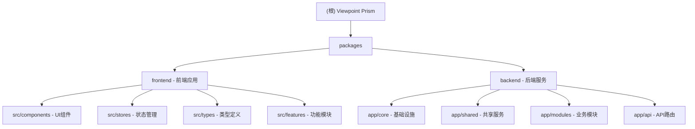

# Viewpoint Prism - 视界棱镜

> **多源视频情报重构系统** - Multi-source Video Intelligence Analysis System

---

## 变更记录 (Changelog)

### 2026-01-14 - 后端 Modular Monolith 重构
- 创建 `app/core/` - 基础设施层 (BaseDAO, BaseService, Exceptions)
- 创建 `app/shared/` - ception, storage共享层 (per)
- 创建 `app/modules/` - 业务模块层 (8个功能模块)
- 前后端代码组织更加清晰

### 2026-01-14 - 前端 Modular Monolith 重构 ⭐NEW
- 创建 `api/` - 统一API层 (client.ts + modules/*.ts)
- 创建 `types/modules/` - 按模块组织的类型定义
- 创建 `features/` - 功能模块目录
- 简化 `app-store.ts` - 使用新的API层
- 保留向后兼容性 (`@/types` 导出)

### 2025-12-30 14:03:28 - 初始化 AI 上下文文档
- 创建根级 `CLAUDE.md` 和模块级文档
- 生成项目结构索引和 Mermaid 结构图
- 识别 2 个核心模块：`frontend` 和 `backend`

---

## 项目愿景

视界棱镜是一个基于 AI 的多源视频情报分析系统，旨在解决短视频生态中内容碎片化、主观性强的问题。系统通过以下核心能力，将非结构化视频内容转化为结构化情报：

- **多模态感知**：音频转写（Paraformer ASR）+ 视觉理解（Qwen-VL）
- **观点冲突检测**：识别不同视频源之间的观点分歧与事实矛盾
- **知识图谱构建**：从视频中抽取实体关系，构建可视化网络
- **智能溯源交互**：点击图谱节点即可定位到原始视频片段
- **创意内容生成**：AI 辩论视频、实体蒙太奇、智能浓缩、AI 导演剪辑

---

## 架构概览

### 后端架构 (Modular Monolith)

```
packages/backend/app/
├── core/                    # 基础设施层 ⭐NEW
│   ├── base_dao.py          # 泛型CRUD基类
│   ├── base_service.py      # 服务基类
│   ├── config.py            # 配置管理
│   ├── database.py          # 数据库连接
│   └── exceptions.py        # 统一异常
│
├── shared/                  # 共享服务层 ⭐NEW
│   ├── perception/          # AI感知服务
│   │   ├── sophnet.py       # LLM/VLM/TTS/Image/Embedding
│   │   ├── asr.py           # 语音识别
│   │   └── types.py         # AI类型定义
│   │
│   └── storage/             # 存储服务
│       └── vector_store.py  # ChromaDB向量存储
│
├── modules/                 # 业务模块层 ⭐NEW
│   ├── source/              # 视频源管理
│   ├── ingest/              # 网络视频获取
│   ├── media/               # 媒体处理
│   ├── analysis/            # 视频分析
│   ├── chat/                # 智能对话
│   ├── nebula/              # 知识星云
│   ├── debate/              # AI辩论
│   ├── director/            # AI导演
│   └── story/               # 漫画/博客
│
└── api/                     # API路由层
    └── __init__.py          # 统一路由汇总
```

### 依赖方向
```
Core ← Shared ← Modules
Core ← Modules (直接依赖)
Modules 之间不直接依赖
```

---

## 前端架构 (Modular Monolith)

```
packages/frontend/src/
├── api/                     # API层 ⭐NEW
│   ├── client.ts            # Axios/Fetch封装
│   └── modules/             # 按后端模块组织
│       ├── source.ts        # 视频源管理
│       ├── ingest.ts        # 网络视频搜索
│       ├── analysis.ts      # 冲突/图谱/时间线
│       ├── chat.ts          # 智能对话
│       ├── nebula.ts        # 知识星云
│       ├── debate.ts        # AI辩论
│       ├── director.ts      # AI导演
│       ├── story.ts         # 漫画/博客
│       └── creative.ts      # 实体/精华片段
│
├── stores/                  # 状态管理
│   ├── app-store.ts         # 主状态管理 (使用新API层)
│   └── index.ts             # Store导出
│
├── types/                   # 类型定义
│   ├── index.ts             # 统一导出 (向后兼容)
│   └── modules/             # 按模块拆分 ⭐NEW
│       ├── source.ts
│       ├── analysis.ts
│       ├── chat.ts
│       └── ...
│
├── features/                # 功能模块 ⭐NEW
│   ├── index.ts             # 统一导出
│   ├── sources/
│   │   ├── SourcesPanel.tsx
│   │   └── index.ts
│   ├── chat/
│   │   ├── ChatPanel.tsx
│   │   └── index.ts
│   ├── analysis/
│   │   └── index.ts
│   └── creative/
│       └── index.ts
│
└── components/              # 共享组件
    ├── layout/
    ├── panels/
    └── ui/
```

---

## 模块结构图



---

## 模块索引

| 模块路径 | 语言 | 职责描述 | 状态 |
|---------|------|---------|------|
| `packages/frontend` | TypeScript + React | Web 前端界面，使用 Vite 构建 | 已重构 |
| `packages/backend` | Python + FastAPI | 后端 API 服务，AI 处理核心 | 已重构 |

---

## 技术栈总览

### 前端 (`packages/frontend`)
- **框架**: React 18 + TypeScript
- **构建**: Vite 5
- **状态管理**: Zustand (已模块化)
- **API层**: 统一API客户端 + 模块化API
- **类型系统**: 按模块拆分的类型定义

### 后端 (`packages/backend`)
- **框架**: FastAPI + Uvicorn
- **数据库**: SQLAlchemy (SQLite)
- **向量存储**: ChromaDB
- **AI 服务**: SophNet (统一AI网关)
- **媒体处理**: FFmpeg
- **内容生成**: FFmpeg + TTS

---

## 运行与开发

### 环境要求
- Node.js >= 18.0.0
- pnpm >= 8.0.0
- Python 3.10+
- FFmpeg

### 安装依赖
```bash
# 前端依赖
pnpm install

# 后端依赖
cd packages/backend
pip install -r requirements.txt
```

### 开发模式
```bash
# 同时启动前后端
pnpm dev

# 单独启动前端
pnpm dev:frontend

# 单独启动后端
pnpm dev:backend
```

### 访问地址
- 前端: http://localhost:5173
- 后端 API: http://localhost:8000
- API 文档: http://localhost:8000/docs

---

## 测试策略

### 测试文件
- `packages/backend/tests/e2e_test.py` - 端到端测试
- `packages/backend/tests/test_phase8.py` - 功能测试
- `packages/backend/tests/unit/` - 单元测试 (待补充)

### 运行测试
```bash
cd packages/backend
pytest tests/
```

---

## 编码规范

### 前端
- ESLint 配置: `packages/frontend/.eslintrc.cjs`
- TypeScript 严格模式
- 组件命名: PascalCase
- 文件命名:
  - 组件: `PascalCase.tsx`
  - 工具: `kebab-case.ts`
  - 类型: `kebab-case.ts`

### 后端
- 遵循 PEP 8 规范
- 异步优先: 使用 `async/await`
- 类型提示: 使用 Python 类型注解
- 日志: 使用 `logging` 模块

### 模块标准结构
每个 `modules/xxx/` 必须包含：
```
xxx/
├── __init__.py        # 模块导出
├── api.py             # FastAPI路由
├── service.py         # 业务逻辑
├── dao.py             # 数据访问
├── models.py          # SQLAlchemy模型
└── schemas.py         # Pydantic模型
```

---

## AI 使用指引

### 项目架构理解
本项目采用 **Modular Monolith** 架构：

1. **Core Layer**: 基础设施 (DAO, Service基类, 异常)
2. **Shared Layer**: 共享服务 (AI感知, 存储)
3. **Modules Layer**: 业务模块 (按功能划分)
4. **API Layer**: 路由汇总

### 关键代码位置

| 功能 | 新路径 | 旧路径 |
|-----|-------|-------|
| AI服务 | `app/shared/perception/` | `app/services/sophnet_service.py` |
| 向量存储 | `app/shared/storage/` | `app/services/vector_store.py` |
| 视频分析 | `app/modules/analysis/` | `app/services/analysis_service.py` |
| 智能对话 | `app/modules/chat/` | `app/services/rag_service.py` |
| AI辩论 | `app/modules/debate/` | `app/services/creator.py` |
| AI导演 | `app/modules/director/` | `app/services/director.py` |
| 知识星云 | `app/modules/nebula/` | `app/services/montage_service.py` |
| 漫画博客 | `app/modules/story/` | `app/services/webtoon_service.py` |

### 新增模块步骤
1. 创建 `app/modules/xxx/` 目录
2. 创建 `api.py`, `service.py`, `dao.py`, `schemas.py`
3. 在 `app/api/__init__.py` 注册路由
4. 更新本文档

---

## 配置说明

### 环境变量
在项目根目录创建 `.env` 文件：

```env
# SophNet API (统一AI网关)
SOPHNET_API_KEY=your_key
SOPHNET_PROJECT_ID=your_project_id

# 数据库
DATABASE_URL=sqlite+aiosqlite:///./data/viewpoint_prism.db

# 上传目录
UPLOAD_DIR=data/uploads
TEMP_DIR=data/temp
```

---

## 工具脚本

| 脚本 | 用途 |
|------|------|
| `scripts/hard_reset.py` | 硬重置项目状态 |
| `scripts/diagnose_state.py` | 诊断项目状态 |
| `scripts/quick_check.py` | 快速健康检查 |
| `scripts/reprocess_video.py` | 重新处理视频 |

---

## 已知限制

1. **API 依赖**: 需要 SophNet API Key 才能使用 AI 功能
2. **视频格式**: 当前支持 MP4 等常见格式，依赖 FFmpeg
3. **并发处理**: 大文件处理可能较慢，建议使用异步任务队列

---

## 下一步建议

### 优先级高
- [x] 前端模块化重构 (拆分stores, 添加features/) ⭐已完成
- [ ] 补充后端单元测试
-API路由 (移除 [ ] 整合旧api文件)
- [ ] 更新后端CLAUDE.md
- [ ] 清理未使用的store文件 (已完成)

### 优先级中
- [ ] 添加任务队列 (Celery/RQ) 处理长时间任务
- [ ] 优化前端性能 (虚拟滚动、懒加载) - 主bundle约2.8MB
- [ ] 添加用户认证和权限管理

### 优先级低
- [ ] Docker 容器化部署
- [ ] 国际化 (i18n) 完善
- [ ] 移动端适配优化
