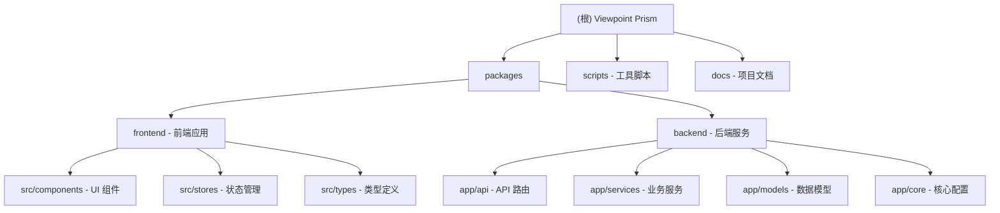

# Viewpoint Prism - 视界棱镜

> **多源视频情报重构系统** - Multi-source Video Intelligence Analysis System

---

## 变更记录 (Changelog)

### 2025-12-30 14:03:28 - 初始化 AI 上下文文档
- 创建根级 `CLAUDE.md` 和模块级文档
- 生成项目结构索引和 Mermaid 结构图
- 识别 2 个核心模块：`frontend` 和 `backend`

---

## 项目愿景

视界棱镜是一个基于 AI 的多源视频情报分析系统，旨在解决短视频生态中内容碎片化、主观性强的问题。系统通过以下核心能力，将非结构化视频内容转化为结构化情报：

- **多模态感知**：音频转写（Paraformer ASR）+ 视觉理解（Qwen-VL）
- **观点冲突检测**：识别不同视频源之间的观点分歧与事实矛盾
- **知识图谱构建**：从视频中抽取实体关系，构建可视化网络
- **智能溯源交互**：点击图谱节点即可定位到原始视频片段
- **创意内容生成**：AI 辩论视频、实体蒙太奇、智能浓缩、AI 导演剪辑

---

## 模块结构图



---

## 模块索引

| 模块路径 | 语言 | 职责描述 | 状态 |
|---------|------|---------|------|
| `packages/frontend` | TypeScript + React | Web 前端界面，使用 Vite 构建 | 活跃 |
| `packages/backend` | Python + FastAPI | 后端 API 服务，AI 处理核心 | 活跃 |

---

## 技术栈总览

### 前端 (`packages/frontend`)
- **框架**: React 18 + TypeScript
- **构建**: Vite 5
- **状态管理**: Zustand
- **UI**: Tailwind CSS + Framer Motion
- **图表**: ECharts + echarts-for-react
- **布局**: react-resizable-panels

### 后端 (`packages/backend`)
- **框架**: FastAPI + Uvicorn
- **数据库**: SQLAlchemy (SQLite)
- **向量存储**: ChromaDB
- **AI 服务**:
  - DashScope (Paraformer ASR + Qwen-VL)
  - OpenAI 兼容 API (ModelScope)
- **媒体处理**: ffmpeg-python, yt-dlp
- **内容生成**: edge-tts, moviepy

---

## 运行与开发

### 环境要求
- Node.js >= 18.0.0
- pnpm >= 8.0.0
- Python 3.10+
- FFmpeg

### 安装依赖
```bash
# 前端依赖
pnpm install

# 后端依赖
cd packages/backend
pip install -r requirements.txt
```

### 开发模式
```bash
# 同时启动前后端
pnpm dev

# 单独启动前端
pnpm dev:frontend

# 单独启动后端
pnpm dev:backend
```

### 访问地址
- 前端: http://localhost:5173
- 后端 API: http://localhost:8000
- API 文档: http://localhost:8000/docs

---

## 测试策略

### 测试文件
- `packages/backend/tests/e2e_test.py` - 端到端测试
- `packages/backend/tests/test_phase8.py` - 功能测试

### 运行测试
```bash
cd packages/backend
pytest tests/
```

---

## 编码规范

### 前端
- ESLint 配置: `packages/frontend/.eslintrc.cjs`
- TypeScript 严格模式
- 组件命名: PascalCase
- 文件命名:
  - 组件: `PascalCase.tsx`
  - 工具: `kebab-case.ts`
  - 类型: `kebab-case.ts`

### 后端
- 遵循 PEP 8 规范
- 异步优先: 使用 `async/await`
- 类型提示: 使用 Python 类型注解
- 日志: 使用 `logging` 模块

---

## AI 使用指引

### 项目架构理解
本项目采用 **5 层漏斗式处理架构**：

1. **感知层** (Perception): ASR 音频转写 + VL 视觉理解
2. **对齐层** (Alignment): 多模态融合为统一日志
3. **认知层** (Cognition): LLM 推理，实体抽取，冲突检测
4. **存储层** (Storage): 向量数据库 + 图数据库 + 关系数据库
5. **表现层** (Presentation): 前端可视化交互

### 关键代码位置
- **AI 服务**: `packages/backend/app/services/intelligence.py`
- **分析服务**: `packages/backend/app/services/analysis_service.py`
- **RAG 服务**: `packages/backend/app/services/rag_service.py`
- **创意生成**: `packages/backend/app/services/creator.py`
- **API 路由**: `packages/backend/app/api/`

### 修改建议
- 修改 AI 模型参数: 编辑 `intelligence.py` 或 `config.py`
- 添加新的分析功能: 在 `analysis_service.py` 中添加方法
- 新增 API 端点: 在 `app/api/` 下创建新路由文件

---

## 配置说明

### 环境变量
在项目根目录创建 `.env` 文件：

```env
# DashScope API (阿里云)
DASHSCOPE_API_KEY=your_dashscope_key

# ModelScope API
MODELSCOPE_API_KEY=your_modelscope_key

# 数据库
DATABASE_URL=sqlite+aiosqlite:///./data/viewpoint_prism.db

# 上传目录
UPLOAD_DIR=data/uploads
TEMP_DIR=data/temp
```

---

## 工具脚本

| 脚本 | 用途 |
|------|------|
| `scripts/hard_reset.py` | 硬重置项目状态 |
| `scripts/diagnose_state.py` | 诊断项目状态 |
| `scripts/quick_check.py` | 快速健康检查 |
| `scripts/reprocess_video.py` | 重新处理视频 |
| `scripts/test_ytdlp.py` | 测试 yt-dlp 功能 |

---

## 已知限制

1. **API 依赖**: 需要 DashScope API Key 才能使用 ASR 和 VL 功能
2. **视频格式**: 当前支持 MP4 等常见格式，依赖 FFmpeg
3. **并发处理**: 大文件处理可能较慢，建议使用异步任务队列

---

## 下一步建议

### 优先级高
- [ ] 补充单元测试覆盖率
- [ ] 添加任务队列 (Celery/RQ) 处理长时间任务
- [ ] 完善错误处理和用户提示

### 优先级中
- [ ] 优化前端性能 (虚拟滚动、懒加载)
- [ ] 添加用户认证和权限管理
- [ ] 支持更多视频平台抓取

### 优先级低
- [ ] Docker 容器化部署
- [ ] 国际化 (i18n) 完善
- [ ] 移动端适配优化
